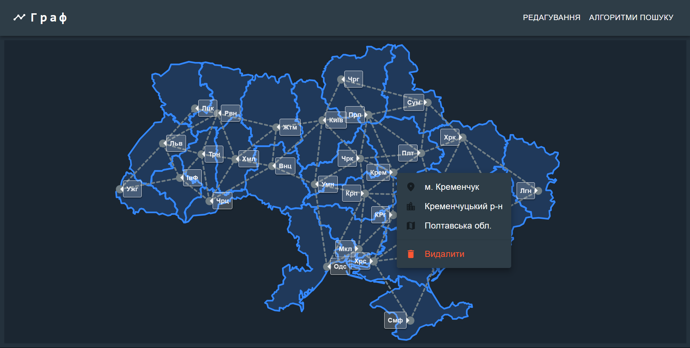
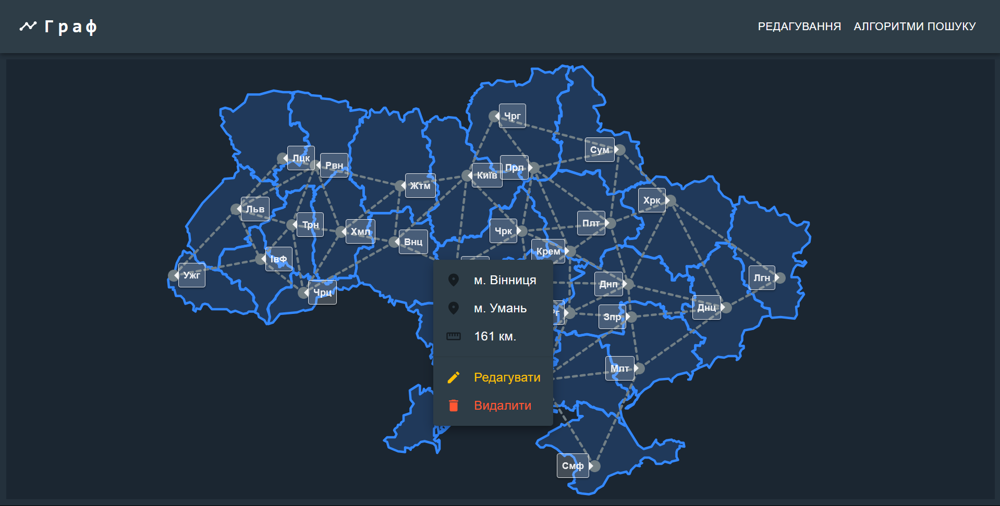
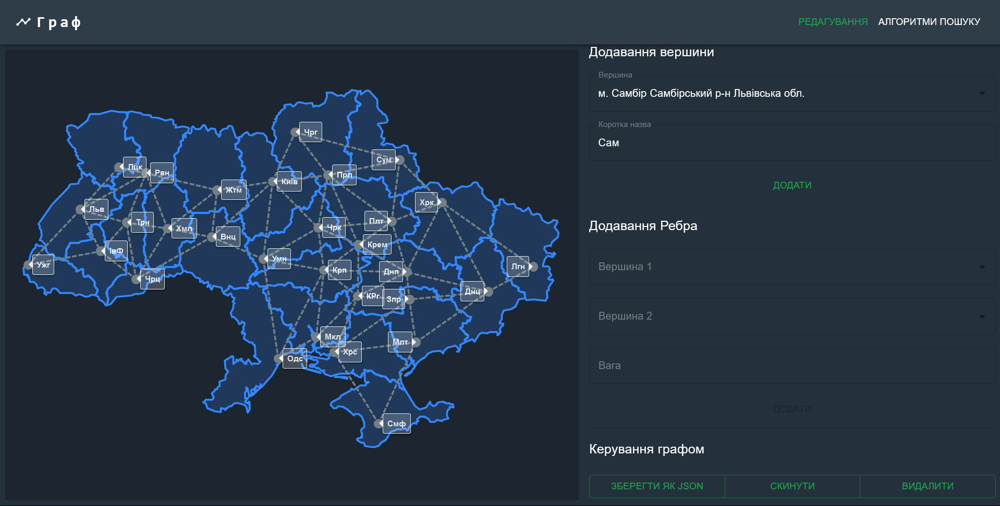
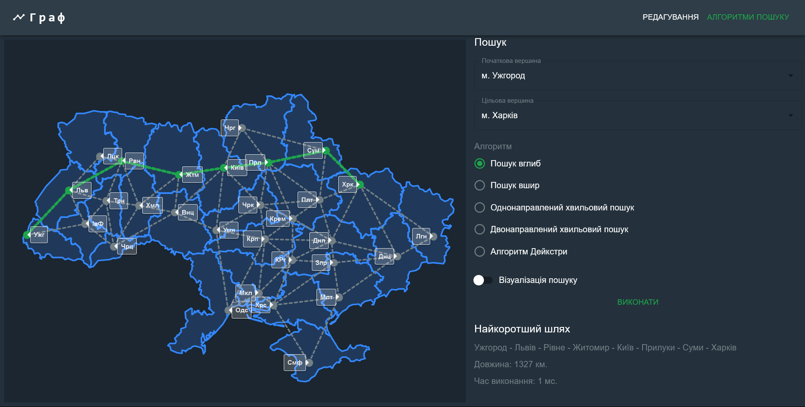

# Graph of Ukraine Cities and Roads

This web application represents a graph of Ukrainian cities and roads on an interactive map. Built using **React**, **TypeScript**, **MUI**, and **react-leaflet**, it allows users to add, modify, or delete cities and roads on the map. The main functionality includes visualizing algorithms to find the shortest path between cities.

## Features

- **Map-based UI**: Interactive map of Ukraine showing a graph of cities and roads.
- **Add/Remove/Edit Nodes and Edges**: Users can add Ukrainian cities (from a predefined list), connect cities with roads, and specify distances. Existing nodes and edges can also be edited or deleted.
- **Graph Persistence**: The graph can be saved to a JSON file or reset to the default state (all major Ukrainian cities and roads).
- **Shortest Path Algorithms**: Users can select two cities and run the following algorithms to find the shortest path:
  - Depth-First Search (DFS)
  - Breadth-First Search (BFS)
  - Unidirectional Wavefront Search
  - Bidirectional Wavefront Search
  - Dijkstra's Algorithm
- **Algorithm Visualization**: Option to visualize the pathfinding process with animations.
- **Performance Metrics**: Shows the shortest path, its length, and the algorithm's execution time.

## Installation

1. Clone the repository:

   ```bash
   git clone https://github.com/CoderPavlo/graph.git
    ```
2. Navigate to the project directory:

    ```bash
    cd graph
    ```
3. Install dependencies:
    ```bash
    npm install
    ```
4. Start the development server:
    ```bash
    npm start
    ```
5. Open http://localhost:3000 to view the app in the browser.
## Application Overview

### Interactions

- **Add City**: Select a city from the list and specify a short name for the vertex.
- **Add Road (Edge)**: Click two cities on the map to connect them with a road, then specify the distance.
- **Edit/Delete**: Modify or remove cities (vertices) and roads (edges).
- **Save/Load Graph**: Save the current state of the graph to a JSON file or reset it to the default graph of major cities.
- **Run Algorithm**: Choose the starting and target cities, select an algorithm, and decide whether to visualize the search.

## Application Screenshots

### Map View Node



### Map View Edge



### Graph Editing 



### Shortest Path Visualization



## JSON Files

Several key JSON files are used to manage the graph and map data:

1. **Map of Ukraine** (`src/data/ukraine.json`):
   - Stores the geographical data for rendering Ukraine's map in GeoJSON format.
   - Used by `react-leaflet` to display the base map.

2. **Default Graph** (`src/data/graph.json`):
   - Represents the initial state of the graph (major Ukrainian cities and roads).
   - Loaded when the app is reset to its default state.

3. **City List** (`src/data/ua_cities.json`):
   - A list of all cities in Ukraine, including their coordinates.
   - Used to position cities correctly on the map when adding new nodes.

4. **Saved Graph** (local storage):
   - When users add/edit nodes or edges, the updated graph is automatically saved in the browser's local storage.
   - If the app is refreshed, the saved graph will be loaded from local storage instead of resetting to the default graph.

## Graph Algorithms

### 1. Depth-First Search (DFS)
Performs a DFS from the starting city to find the shortest path to the target city.

### 2. Breadth-First Search (BFS)
Uses BFS to explore the graph in layers, finding the shortest path between two cities.

### 3. Unidirectional Wavefront Search
A wavefront expands from the starting city, exploring each possible path to the target city.

### 4. Bidirectional Wavefront Search
Simultaneously searches from both the starting and target cities, meeting in the middle to find the shortest path.

### 5. Dijkstra's Algorithm
Finds the shortest path based on the road distances, ensuring the shortest path in terms of travel length.

## License

This project is licensed under the MIT License.

